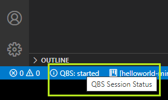
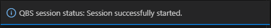
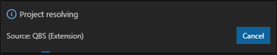

# QBS: Build

Once as you open the directory with the file `*.qbs` project file, the QBS
extension is automatically initialized, and then starts the QBS session.

You can make sure that the QBS session is initialized successfully by
looking at the caption `QBS: started` on the corresponding button on
the status bar:

Also, in the lower right corner of VS Code, the popup notifications will
be displayed that the QBS executable file has been found and the QBS session
has started successfully:

If something goes wrong, the user can manually restart the QBS session
using the following commands:

* From the command palette in VS Code, run the **QBS: Stop Session** command
to stop the session.

* From the command palette in VS Code, run the **QBS: Start Session** command
to start the session.

* From the command palette in VS Code, run the **QBS: Auto Restart Session**
command to restart the session (performs the stop and the start sequence
automatically).

## Select a project

When the directory with the project is opened in VS Code, QBS automatically
sets the first project file in this directory as the default project.

The reason is that there can be several project files in one directory,
and the choice of the one you need depends on you:

* From the command palette in VS Code, run the **QBS: Select Project** command,
or press the **Click to Select the Active Project** button in the status bar.

When the project is selected, its name will be displayed in the
corresponding button caption:

## Resolve a project

When the project is selected, the QBS automatically starts the project
resolving operation. This operation scans the project dependencies and
creates the build tree.

The progress of this operation is displayed in the corresponding
popup message:

The user can start the resolving manually:

* From the command palette in VS Code, run the **QBS: Resolve** command.

## Next steps

- Explore the [QBS documentation](README.md)
