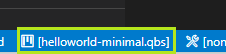
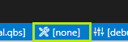
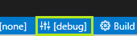
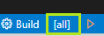
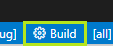
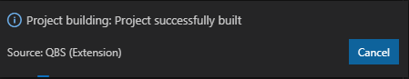
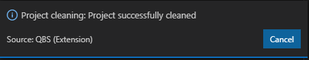
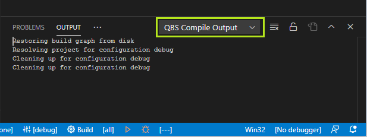

# QBS: Build

Once as you open the directory with the file `*.qbs` project file, the QBS
extension is automatically initialized, and then starts the QBS session.

You can make sure that the QBS session is initialized successfully by
looking at the caption `QBS: started` on the corresponding button on
the status bar:

If something goes wrong, the user can manually restart the QBS session
using the following commands:

* From the command palette in VS Code, run the **QBS: Stop Session** command
to stop the session.

* From the command palette in VS Code, run the **QBS: Start Session** command
to start the session.

* From the command palette in VS Code, run the **QBS: Auto Restart Session**
command to restart the session (performs the stop and the start sequence
automatically).

## Select a project

When the directory with the project is opened in VS Code, QBS automatically
sets the first project file in this directory as the default project.

The reason is that there can be several project files in one directory,
and the choice of the one you need depends on you:

* From the command palette in VS Code, run the **QBS: Select Project** command,
or press the **Click to Select the Active Project** button in the status bar.

When the project is selected, its name will be displayed in the
corresponding button caption:

## Resolve a project

When the project is selected, the QBS automatically starts the project
resolving operation. This operation scans the project dependencies and
creates the build tree.

The progress of this operation is displayed in the corresponding
popup message:

The user can start the resolving manually:

* From the command palette in VS Code, run the **QBS: Resolve** command.

## Configure a project

The procedure for configuring a project is to select the desired
`profile`, `configuration`, and `product` for building:

* To select the build profile, from the VS Code command pallette
run the **QBS: Select Build Profile** command, or press the
**Click to Select the Build Profile** button in the status bar:

* To select the build configuration, from the VS Code command pallette
run the **QBS: Select Build Configuration** command, or press the
**Click to Select the Build Configuration** button in the status bar:

Currently the pre-defined `release`, `debug`, `profiling`, and the any
custom configurations are supported.

* To select the build product, from the VS Code command pallette
run the **QBS: Select Build Product** command, or press the
**Click to Select the Product to Build** button in the status bar:

You can choose to build either one product or `[all]` products.

When any of these properties change, QBS will automatically start
auto-resolving the project again.

The progress of this operation is displayed in the corresponding
popup message:

## Build a project

To build the project, from the VS Code command pallette run the
**QBS: Build** command, or press the **Build** button in the status bar:

The progress of this operation is displayed in the corresponding
popup message:

## Clean a project

To clean the build, from the VS Code command pallette run the
**QBS: Clean** command.

The progress of this operation is displayed in the corresponding
popup message:

## Watch for output

The progress of operations such as `resolving`, `building`, and
`cleaning' is also displayed as text messages reported from QBS.

The QBS extension provides one output channel for displaying
the messages:

* **QBS Compile Output** - displays the messages of the main build,
cleanup and resolve processes, and also the internal service messages
(e.g. comes from the JS engine of QBS):

## Next steps

- Explore the [QBS documentation](README.md)
