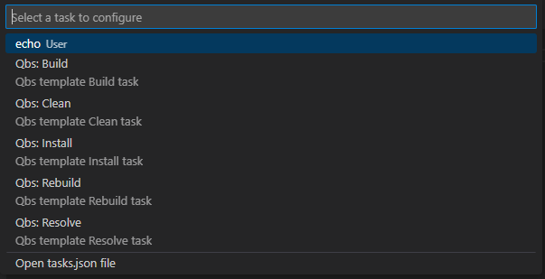

# Resolve with Qbs tools tasks

You can create a resolve task from the VS Code command pallette by running the **Tasks: Configure task** command.



By selecting "Qbs: Resolve" template this task will be generated in `tasks.json` file:

```json
    {
        "type": "qbs",
        "label": "Qbs: Resolve",
        "command": "resolve",
        "problemMatcher": [],
        "detail": "Qbs template Resolve task"
    }
```

**Note**: You can change the `label` and the `detail` properties as you want.

# Build with Qbs tools tasks

You can create a build task from the VS Code command pallette by running the **Tasks: Configure task** command.

By selecting "Qbs: Build" template this task will be generated in `tasks.json` file:

```json
    {
        "type": "qbs",
        "label": "Qbs: Build",
        "command": "build",
        "products": [
            "current_product_name"
        ],
        "group": "build",
        "problemMatcher": [],
        "detail": "Qbs template Build task"
    }
```

**Note**: The `products` property will be automatically filled with the current build product selected
from the status bar.

**Note**: The empty `products` property as `[]` means that all products will be build.

**Note**: You can change the `label`, `detail`, and `products` properties as you want.

# Clean with Qbs tools tasks

You can create a clean task from the VS Code command pallette by running the **Tasks: Configure task** command.

By selecting "Qbs: Clean" template this task will be generated in `tasks.json` file:

```json
    {
        "type": "qbs",
        "label": "Qbs: Clean",
        "command": "clean",
        "products": [
            "current_product_name"
        ],
        "group": "clean",
        "problemMatcher": [],
        "detail": "Qbs template Clean task"
    }
```

**Note**: The `products` property will be automatically filled with the current build product selected
from the status bar.

**Note**: The empty `products` property as `[]` means that all products will be cleaned.

**Note**: You can change the `label`, `detail`, and `products` properties as you want.

# Install with Qbs tools tasks

You can create an install task from the VS Code command pallette by running the **Tasks: Configure task** command.

By selecting "Qbs: Install" template this task will be generated in `tasks.json` file:

```json
    {
        "type": "qbs",
        "label": "Qbs: Install",
        "command": "install",
        "products": [
            "current_product_name"
        ],
        "problemMatcher": [],
        "detail": "Qbs template Install task"
    }
```

**Note**: The `products` property will be automatically filled with the current build product selected
from the status bar.

**Note**: The empty `products` property as `[]` means that all products will be installed.

**Note**: You can change the `label`, `detail`, and `products` properties as you want.

# Rebuild with Qbs tools tasks

You can create a rebuild task from the VS Code command pallette by running the **Tasks: Configure task** command.

By selecting "Qbs: Rebuild" template this task will be generated in `tasks.json` file:

```json
    {
        "type": "qbs",
        "label": "Qbs: Rebuild",
        "command": "rebuild",
        "products": [
            "current_product_name"
        ],
        "group": "rebuild",
        "problemMatcher": [],
        "detail": "Qbs template Rebuild task"
    }
```

**Note**: The `products` property will be automatically filled with the current build product selected
from the status bar.

**Note**: The empty `products` property as `[]` means that all products will be rebuild.

**Note**: You can change the `label`, `detail`, and `products` properties as you want.
